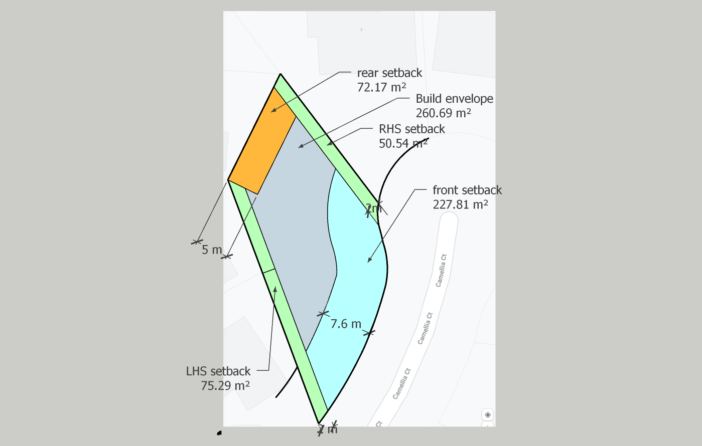
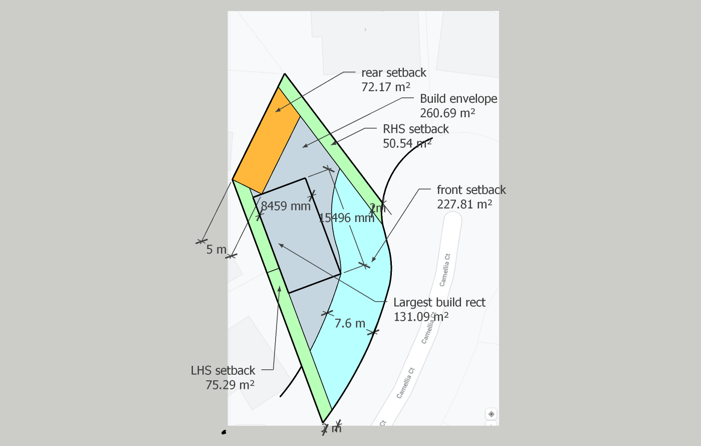
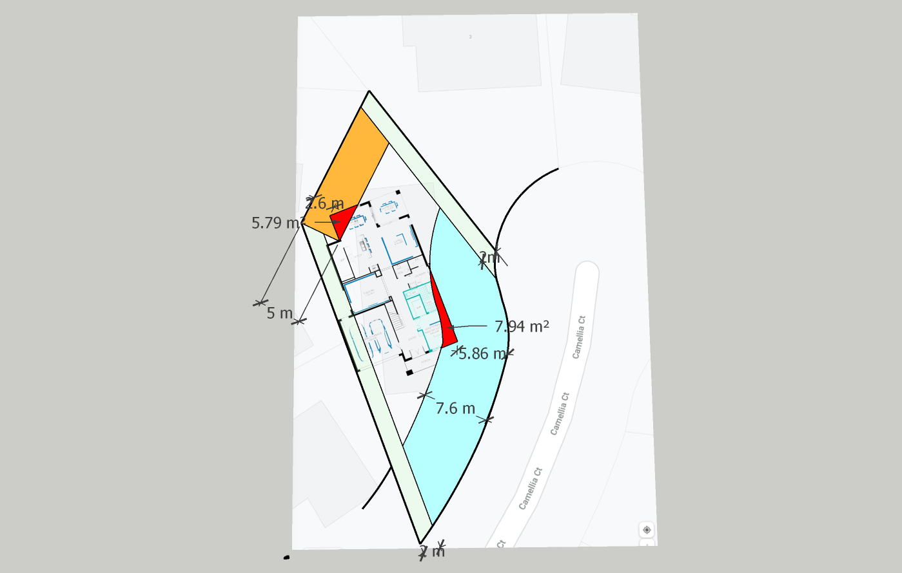
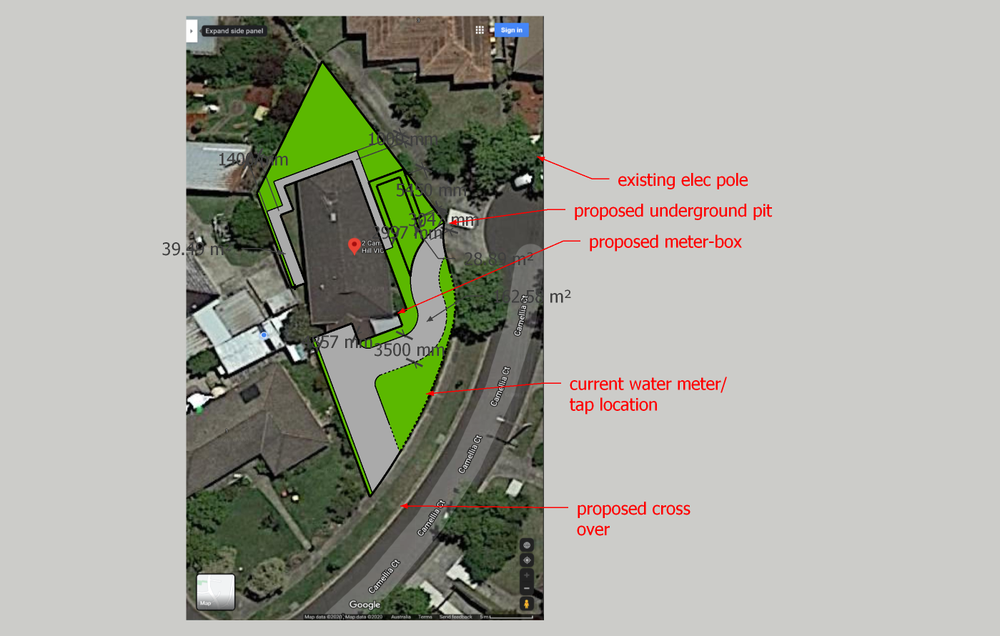

# Dorchester on Camellia Ct

Hi Stephanie,

In this repository you will find my notes with regards to getting the Dorchester design on our property as per our requirements.

---
## Setbacks & build envelope

The build envelope represents the acceptable build region by the Monash council. This region is illustrated as the central area in the figure below.

Figure 1: Build envelope with front, read & side setbacks 

Figure 2: largest rectangular area w/o violating setbacks 

### Summary

|**Setback**|**Total Surface Area**|**Percentage of property**|
|:---:|:---:|:---:|
|Rear (ie. north)|72.17m2|10.51%|
|Right (ie. west)|50.54m2|7.36%|
|left (ie. east)|75.29m2|10.97%|
|Front (ie. south)|227.81m2|33.18%|
|**Total setback**|**425.81m2**|**62.03%**|
Table 1: setback summary table

|**Build envelope**|**Total Surface Area**|**Percentage of property**|
|:---:|:---:|:---:|
|Largest rectangle|131.09m2|19.10%|
|odd shaped area|129.6m2|18.88%|
|**Total build envelope**|**260.69m2**|**37.97%**|
Table 2: build envelope summary table

|**Summary**|**Total Surface Area**|**Percentage of property**|
|:---:|:---:|:---:|
|Setbacks|425.81m2|62.03%|
|Build envelope|260.69m2|37.97%|
|**TOTAL**|**686.5m2**|**100%**|
Table 3: Totals summary table

The data from the tables above suggest that should the planning minister's regulations be honoured then over 80% of the 686.5m2 block is rendered unusable for a standard rectangular home design.

---
## Dorchester Ground Floor Sitting

To be more consistent in line with other houses in the court a slight preference has been given to reducing the front setback violation over the rear setback violation. 

This sitting of the Dorchester design on this property tries to achieve the most likely approvable positioning with regards to rear & front setbacks.

Figure 3: Dorchester sitting 

The regions marked in red are the violations (ie. the areas of concern that encrouch the setbacks). These violations should however be considered in context of the setback & build envelope section above.

|**Setback**|**Total Surface Area**|**Violation Area**|**Percentage**|**Min setback**
|:---:|:---:|:---:|:---:|:---:|
|Rear (ie. north)|72.17m2|**5.79m2**|8.02%|2.6m|
|Front (ie. south)|227.81m2|**7.94m2**|3.49%|5.86m|

In the context of things, these are the smallest violations that I could achieve which I feel will result in approval by council. 

---
## Dorchester WRT utilities

Figure 4: Dorchester sitting wrt utilities 

The figure above illustrates the following points of interest:

1. The concreting require to the garage and the connection to the existing cross-over
2. The location of the new cross-over
3. The current location of the water meter
4. The proposed location of the underground pit
5. The exising electrical pole    

