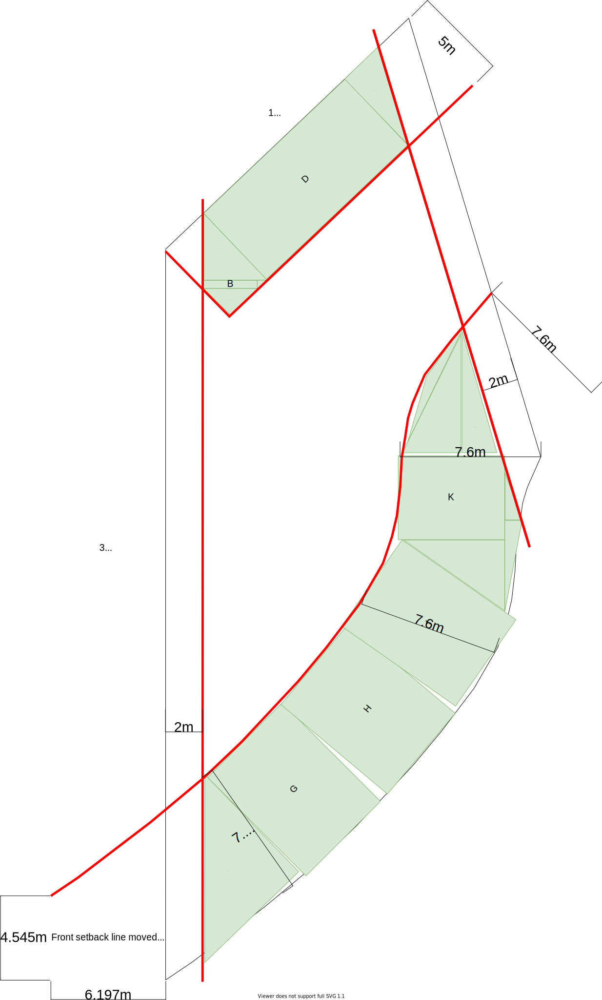
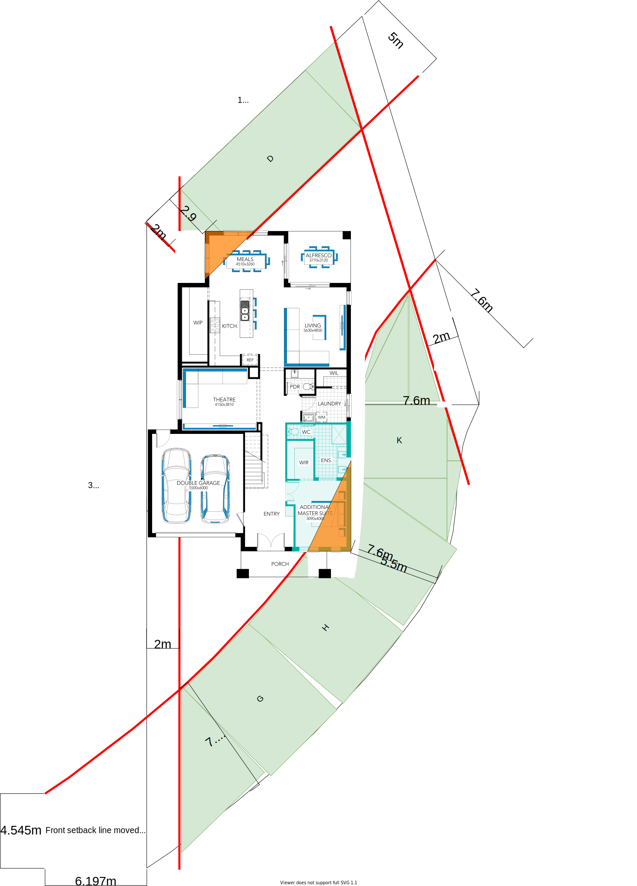

# Dorchester on Camellia Ct

Hi Nathan,

In this repository you will find my notes with regards to getting the Dorchester design on our property as per our requirements.

---
## Build envelope

The build envelope represents the acceptable build region by the Monash council. This region is illustrated as the central area in the figure below.

Figure 1: Build envelope with front, read & side setbacks 

---
## Dorchester Ground Floor Sitting

To be more consistent in line with other houses in the court a slight preference has been given to reducing the front setback violation over the rear setback violation. 

This sitting of the Dorchester design on this property tries to achieve the most likely approvable positioning with regards to rear & front setbacks.

Figure 2: Dorchester sitting 

The regions marked in orange are the violations (ie. the areas of concern that encrouch the setbacks). These violations should however be considered in context of the setback areas.

|**Setback**|**Total Surface Area**|**Violation Area**|**Percentage**|
|:---:|:---:|:---:|:---:|
|Front (ie. south)|214m2|**7.3m2**|3.4%|
|Rear (ie. north)|69m2|**8.6m2**|12.4%|

In the context of things, these are the smallest violations that I could achieve which I feel will result in approval by council. 

I have contacted council to verify that the garage on the east side setback and the porch on the front setback are not significant issues in this instance. However, this sitting should be verified by Carlisle's site surveyor.

---
## Dorchester Ground Floor Changes

The following are the preferred changes to the ground level:

1. Additional Master Suite (I.L.O Lounge)
2. Shower to Powder
3. change Theatre into a BED 5 by adding ROBE and entry/exit door with west wall
4. Add external double powerpoint to ALFRESCO area

Nathan, the website will not let me select both options 1 & 2 above. It's difficult to tell whether this is a website bug or whether their is a design/build problem with this combination. What I was thinking was to have my dad in the ground-level master bed (change 2) & in-laws in the BED 5 with an adjacent full bathroom (changes 3 & 4).

You previously gave me indicative pricing for Cottesloe. Can you please confirm the pricing for the Dorchester?

---

## Additions that are still no accounted for

1. Day/night blinds or curtains
2. Exposed concrete of driveway and other areas
3. Council Crossover 5K?
4. Solar panels and solar battery
5. UHF antenna connection points in rooms

---

## Preferences

1. Facade roof design (eg. gable two sides over four sided) that allows greater number of solar panels installed 